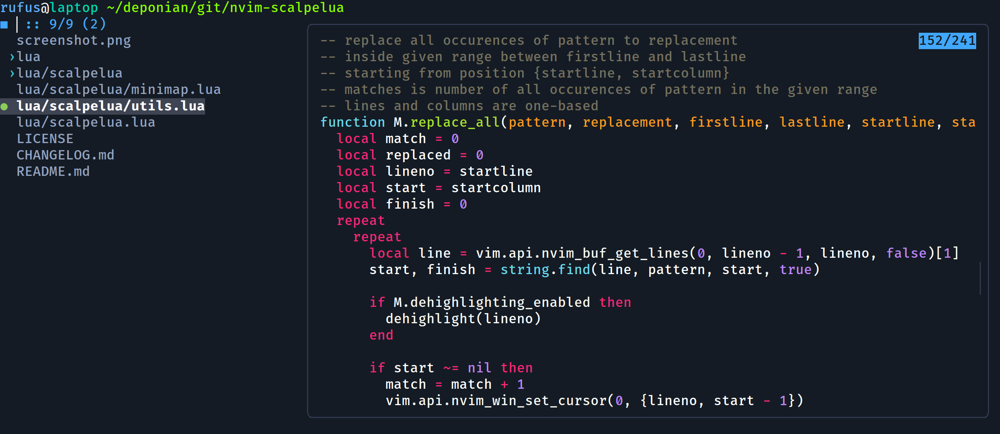

# fzf module for Prezto Zsh framework

This plugin helps to configure fzf through `zstyle` configuration options.



## Installation

Prezto will load external modules found in the `$ZDOTDIR/.zprezto/contrib` directory so this is a good place to install this plugin:

```zsh
cd $ZPREZTODIR
mkdir -p contrib
git submodule add -f https://github.com/deponian/fzf-prezto contrib/fzf
```

## Settings

Enable the plugin by adding `fzf` to the `zstyle ':prezto:load' pmodule` list in your `.preztorc` file.

You can then add the following configuration options to your `.preztorc` to customise the behaviour:

```zsh
# Forcefully set to fzf installation directory path - default: will try to detect the correct location
zstyle ':prezto:module:fzf' fzf-base '/path/to/fzf/install/dir'

# Set the default command to use when input is tty - default is to set it to these in the order in which they're found:
# - `fd --type f --hidden --no-ignore --exclude .git`
# - `rg --files --hidden --no-ignore --glob "!.git/*"`
# - `ag -l --hidden -g "" --ignore .git`
zstyle ':prezto:module:fzf' fzf-default-command 'fd --type file --follow --hidden --no-ignore --exclude .git'

# Disable keybindings - default: no
zstyle ':prezto:module:fzf' disable-key-bindings 'no'

# Disable completion - default: no
zstyle ':prezto:module:fzf' disable-completion 'no'

# Set default options - default: empty
zstyle ':prezto:module:fzf' fzf-default-opts \
  '--info=inline:":: "' \
  '--no-separator' \
  '--prompt="■ "' \
  '--pointer="●"' \
  '--marker="›"'

# Set height of the fzf results - default: 50%
zstyle ':prezto:module:fzf' height '70%'

# Set width of fzf preview window - default: right:50%
zstyle ':prezto:module:fzf' width 'right:60%'

# Show file preview with ctrl+t and directory contents preview (needs tree) with alt-c
# Uses `bat` if it's installed
zstyle ':prezto:module:fzf' preview 'yes'

# Open fzf results in a tmux pane, if using tmux - default: no
 zstyle ':prezto:module:fzf' tmux 'no'

# Order output in reverse order - default: no
zstyle ':prezto:module:fzf' reverse 'no'

# Set the color scheme
zstyle ':prezto:module:fzf' color-scheme 'One Dark Deep'
```

## Color Schemes

The `colors.zsh` file currently contains fifteen color schemes from <https://github.com/junegunn/fzf/wiki/Color-schemes> and the four defaults: `dark`, `light`, `16` and `bw`. You can add your own schemes to the `colors.zsh` file and set the scheme in your `.zpreztorc`.

## Acknowledgements

Thanks to [lildude/fzf-prezto](https://github.com/lildude/fzf-prezto) repository where I took most of the configuration.
